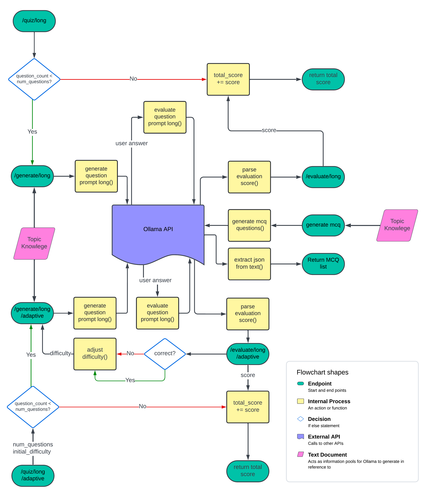

# LLM Question Generation

This project is an adaptive quiz system designed to dynamically generate and evaluate quiz content based on user interactions. The system is integrated with an API that processes user inputs and adjusts the difficulty of questions according to their performance.

## System Overview

The Adaptive Quiz System allows for the creation of multiple types of questions, including multiple-choice questions (MCQ) and long-answer questions. The system adapts to the user's knowledge level by adjusting the difficulty of subsequent questions based on the user's previous responses. The system also supports evaluating responses to provide feedback and scores.

The project is composed of three main components, as shown in the flowchart below:

### 1. MCQ Generation

- **Endpoint**: `/generate/mcq`
- **Description**: Generates a specified number of multiple-choice questions based on the provided text. The system returns the questions and answers in JSON format.
- **Flow**:
  - The text is passed to the `generate_mcq_questions()` function.
  - The Ollama API processes the request and returns MCQs.
  - The MCQs are extracted from the response using the `extract_json_from_text()` function.
  - The final MCQ list is returned to the user.

### 2. Long Answer Question

- **Endpoints**:
  - `/generate/long`: Generates an open-ended question based on the provided text, avoiding previously asked questions.
  - `/evaluate/long`: Evaluates the user's response to the long answer question, providing feedback and a score.
- **Flow**:
  - The user provides the text and previous questions (if any) to generate a new question.
  - The `generate_question_prompt_long()` function formulates the prompt for the Ollama API.
  - The API returns the generated question, which is sent back to the user.
  - The user responds to the question, and the response is evaluated using `evaluate_response_prompt_long()`.
  - The system parses the evaluation and scores using `parse_evaluation_score()`, then returns the score and feedback.

### 3. Adaptive Long Answer Question

- **Endpoints**:
  - `/generate/long/adaptive`: Generates an adaptive open-ended question based on the provided text and current difficulty level.
  - `/evaluate/long/adaptive`: Evaluates the user's response to an adaptive long answer question, providing feedback and a score, and adjusting the difficulty for the next question.
- **Flow**:
  - Similar to the standard long answer flow, but with an additional step to adjust the difficulty level.
  - The `adjust_difficulty()` function is used to modify the difficulty based on the user's score.
  - The system adapts the next question according to the new difficulty level, allowing the quiz to dynamically respond to the user's performance.
