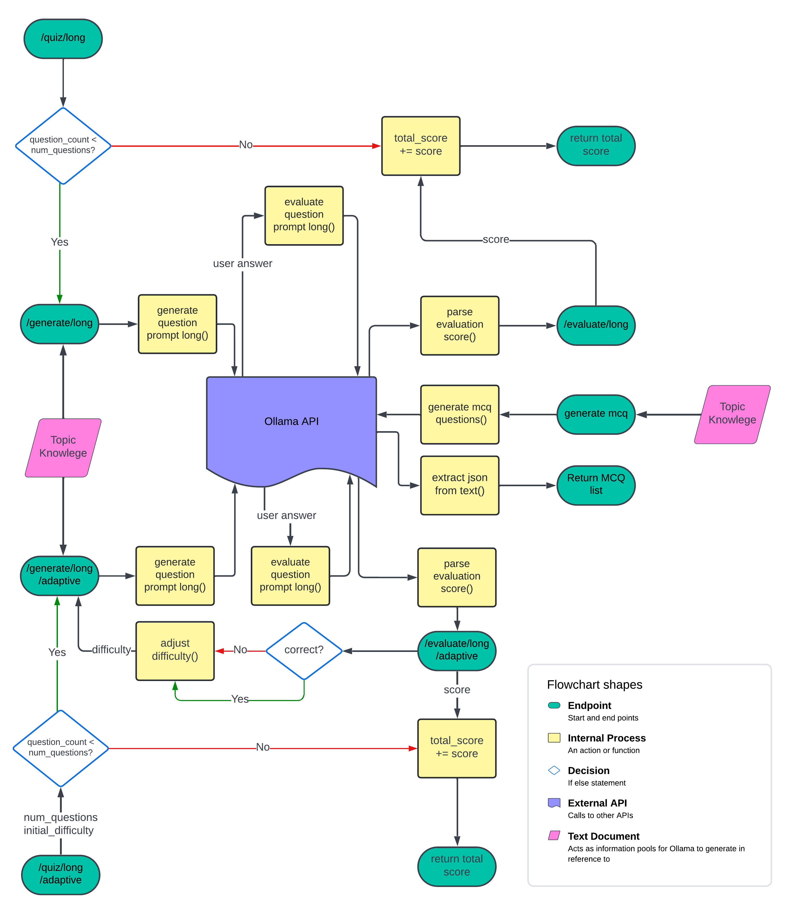

# การสร้างคำถามด้วย LLM

โปรเจกต์นี้เป็นระบบสอบปรับระดับความยากตามผู้ใช้งาน ออกแบบมาเพื่อสร้างและประเมินเนื้อหาการสอบตามการโต้ตอบของผู้ใช้ ระบบนี้ผสานรวมกับ API ที่ประมวลผลข้อมูลจากผู้ใช้ และปรับความยากของคำถามตามผลการตอบของผู้ใช้แต่ละคน

## ภาพรวมของระบบ

ระบบสอบปรับระดับนี้สามารถสร้างคำถามได้หลากหลายรูปแบบ ทั้งคำถามแบบหลายตัวเลือก (MCQ) และคำถามแบบปลายเปิด (ตอบยาว) ระบบจะปรับระดับความยากของคำถามตามความรู้และความสามารถของผู้ใช้โดยอิงจากคำตอบที่เคยให้ไว้ ระบบยังรองรับการประเมินคำตอบเพื่อให้ข้อเสนอแนะและคะแนนเพื่อการเรียนรู้ที่ดีขึ้น

โปรเจกต์นี้แบ่งออกเป็น 3 ส่วนหลัก ๆ ดังที่แสดงในแผนภาพด้านล่าง:

### 1. การสร้างคำถามแบบหลายตัวเลือก (MCQ)

- **Endpoint**: `/generate/mcq`
- **คำอธิบาย**: สร้างคำถามแบบหลายตัวเลือกตามจำนวนที่กำหนดจากข้อความที่ให้ ระบบจะส่งคืนคำถามและคำตอบในรูปแบบ JSON
- **ขั้นตอนการทำงาน**:
  - ข้อความจะถูกส่งไปยังฟังก์ชัน `generate_mcq_questions()`
  - Ollama API จะประมวลผลคำขอและส่งคืนคำถามแบบหลายตัวเลือก (MCQ)
  - ระบบจะใช้ฟังก์ชัน `extract_json_from_text()` เพื่อดึงข้อมูลคำถามและคำตอบจากการตอบกลับ
  - รายการคำถามและคำตอบสุดท้ายจะถูกส่งคืนให้กับผู้ใช้

### 2. คำถามแบบปลายเปิด (ตอบยาว)

- **Endpoints**:
  - `/generate/long`: สร้างคำถามแบบปลายเปิดจากข้อความที่ให้ โดยหลีกเลี่ยงคำถามที่เคยถามไปแล้ว
  - `/evaluate/long`: ประเมินคำตอบของผู้ใช้ในคำถามแบบตอบยาว โดยให้ข้อเสนอแนะและคะแนน
- **ขั้นตอนการทำงาน**:
  - ผู้ใช้ให้ข้อมูลข้อความและคำถามที่เคยถูกถามมาก่อน (ถ้ามี) เพื่อใช้ในการสร้างคำถามใหม่
  - ฟังก์ชัน `generate_question_prompt_long()` จะจัดการคำขอเพื่อส่งให้กับ Ollama API
  - API จะส่งคืนคำถามที่สร้างขึ้น ซึ่งจะถูกส่งคืนให้กับผู้ใช้
  - ผู้ใช้ตอบคำถาม และคำตอบนั้นจะถูกประเมินด้วยฟังก์ชัน `evaluate_response_prompt_long()`
  - ระบบจะวิเคราะห์การประเมินและคะแนนด้วย `parse_evaluation_score()` จากนั้นส่งคืนคะแนนและข้อเสนอแนะให้กับผู้ใช้

### 3. คำถามแบบปลายเปิดปรับระดับความยาก

- **Endpoints**:
  - `/generate/long/adaptive`: สร้างคำถามแบบปลายเปิดที่ปรับตามข้อความที่ให้และระดับความยากในขณะนั้น
  - `/evaluate/long/adaptive`: ประเมินคำตอบของผู้ใช้ในคำถามแบบตอบยาวปรับระดับความยาก โดยให้ข้อเสนอแนะและคะแนน พร้อมปรับระดับความยากของคำถามถัดไปตามผลการตอบ
- **ขั้นตอนการทำงาน**:
  - คล้ายกับขั้นตอนของคำถามแบบปลายเปิดทั่วไป แต่มีขั้นตอนเพิ่มเติมในการปรับระดับความยากของคำถาม
  - ฟังก์ชัน `adjust_difficulty()` จะถูกใช้เพื่อปรับระดับความยากตามคะแนนของผู้ใช้
  - ระบบจะปรับคำถามถัดไปตามระดับความยากใหม่ ทำให้การสอบปรับตามความสามารถของผู้ใช้ในแบบไดนามิก
